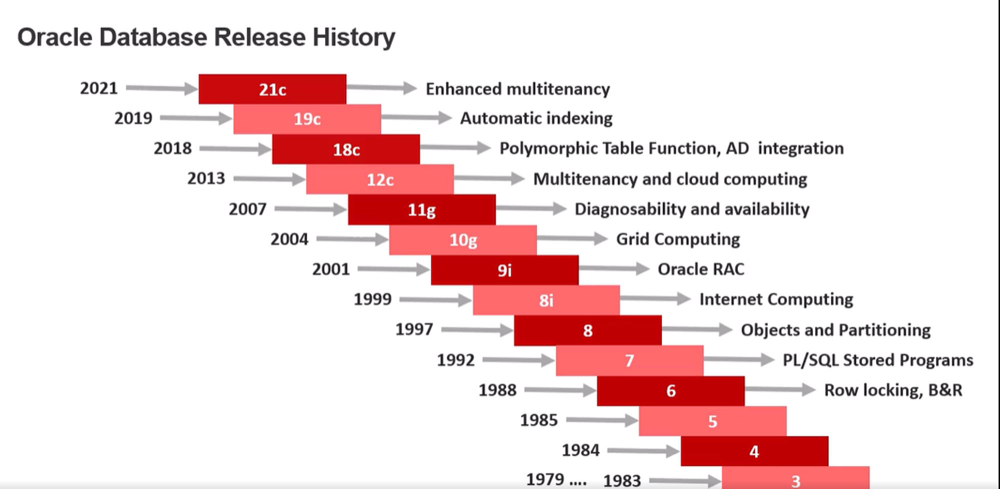
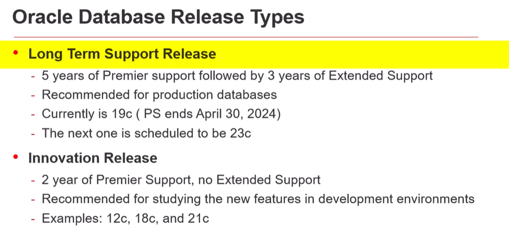
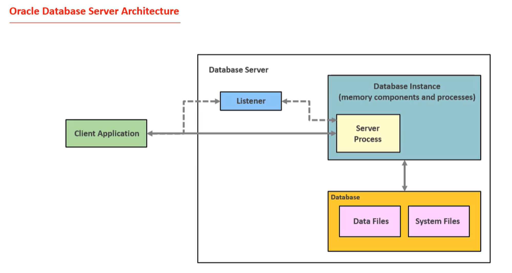
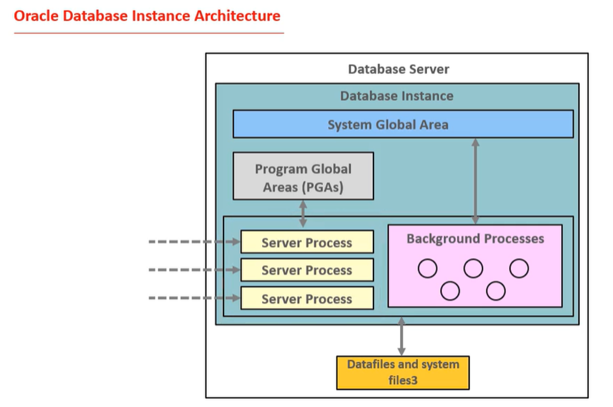
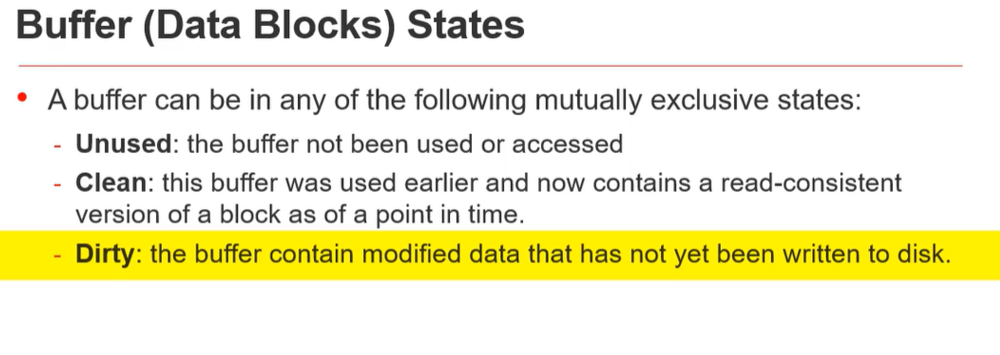

# Investigation about Oracle Databases

## Introduction

This document contains the results of the investigation about Oracle databases. 
More specifically, it contains information about how we can monitor its metrics.

## Oracle Release history

Fun fact

The first version of Oracle was called Oracle V2, released in 1979 by Oracle Corporation, which was then known as Software Development Laboratories (SDL).
Oracle V2 was the first commercially available relational database management system (RDBMS) to use SQL (Structured Query Language), which has since become the standard language for database queries. The version numbering started at V2 to imply that the software was already mature and production-ready

---

## Oracle Release Types

## Oracle Licenses
Are quite an important concept in Oracle. When you buy an edition license, you don’t get all the feature of the license by default;

## Oracle Db Architecture

Oracle accept connection from clients using a Listener that is not part of the Oracle Database process but it runs on his own.
For each established connection Oracle spawns a new process called Server Process.

Oracle Database memory is divided into two main areas:
### System Global Area (SGA)

Dedicated to the whole Database Instance.
Server process can read and write to the SGA.

#### Shared Pool

Shared Pool is used to save the SQL statements and PL/SQL code executed by the clients in the sub area called Library Cache. It also contains the following other sub areas, Data Dictionary Cache, Server Result Cache, and Reserved pool.

**This might be important**
The Data Dictionary Cache holds information about the accessed database objects. It doesn't contain data saved in the object, it contains data about the object. This information is called Data Dictionary. This is needed by Oracle database when executing the statements.

#### Database Buffer Cache

This area is used to save the copies of the data blocks. When the clients submit the queries to the database to retrieve some data, by default, the data blocks that contain the required data are not read from the data files in the storage, straight to the client process. They are saved in the buffer cache first to optimize the I/O operation. If later the same data is required, the server process doesn't need to read it again from the storage, it reads the required data from the memory, and sends it back to the requester. Obviously, this is much faster than reading the data from the storage.

#### Large Pool

Large Pool memory is used for buffers during backup and recovery operations, buffers for different inserts, message buffers used in parallel executions, and some others.

#### Redo Log Buffer

The next memory area is the Redo Log Buffer. This memory is used to save information about the changes made on the data by DML and DDL statements. Internally, the changes made to the data is saved in records called redo entries. Redo entries have the information to reconstruct or to redo the changes made to the data. They are not copies of the changed data itself. They contain information enough to redo the changes made on the data.
Those are the corrispective of WAL Files in SQL Server and Postgres.

### Program Global Area (PGA)
Store memory data required for Server Process
Each process has his own private area in the PGA

### System Processes

| Process | Name            | Description                                                                                                                                               |
|---------|-----------------|-----------------------------------------------------------------------------------------------------------------------------------------------------------|
| DBWn    | Database Writer | Write modified blocks (or dirty blocks from the buffer cache to the data files in the storage)                                                            |
| LGWR    | Log Writer      | This process is responsible for writing redo entries from the Redo Log Buffer to the Redo Log Files                                                       |
| CKPT    | Checkpoint      | It updates the control file and the data file headers with checkpoint information and it signals that DB Writer to write the modified blocks to the disk. |

### Buffer Data Blocks
In Oracle databases, user data is saved in a small storage units called Data Blocks. When the rows are retrieved by the clients, the data blocks containing the required rows are read from the storage and saved in the data buffer cache. For the sake of simplicity, data buffer cache memory units could be called just buffer.

---
## Multitenant Architecture
From version 12c Oracle offers to have the possibility a Multitenant Database. This means that is possible to have more than 1 database inside the same database instance.
This introduce two concept:

### Container Database
It's scope is to hold metadata related to the pluggable databases. 
It's a read-only database. 
It's also called root database (CDB$ROOT). T
Should not contain application specific data.

### Pluggable Database
Portable collection of schemas, schema objects, and nonschema objects that appears to an Oracle Net client as a non-CDB.
---

## Oracle Connection
Oracle uses the Oracle Net Listener to manage incoming client connections. The listener is configured with a default port (1521 is the default), and it can handle connections to multiple database instances on the same server. You can configure multiple listeners on different ports if necessary, but a single listener can route connections to multiple instances based on the connection string used by the client.
When dealing with multiple CDBs (each with potentially multiple PDBs) on a single server, you can:
Use a single listener on the default port (or any custom port) to manage connections to all the CDBs/PDBs. The connection differentiation is handled by the service names defined within each CDB/PDB.

---
### Question to Answer
During the investigation I tried to answer to the following questions:

#### 1 Are there any considerable difference in terms of DB Structure?
I think is already answered in the Readme. Check out the Oracle Db Architecture section.

#### 2 How can I connect to an Oracle Database?
The connection string to connect to an Oracle Database is composed by the following elements:
- Hostname
- Port
- Service Name
- Username
- Privileged Dba
- Password

#### 3 How can I get Db Version?
See [here](./Services/OracleVersionQueryExecutor.cs)

#### 4 How do we sample queries? Are there caches / statistics mantained by the db engine?
See [here](./Services/OracleTopQueriesQueryExecutor.cs)
Information about the V$SQLAREA can be found [here](https://docs.oracle.com/en/database/oracle/oracle-database/12.2/refrn/V-SQLAREA.html#GUID-09D5169F-EE9E-4297-8E01-8D191D87BDF7)

#### 5 How do we sample Query Plan?
See [here](./Services/OracleQueryPlanQueryExecutor.cs)
Information about V$SQL_PLAN can be found [here](https://docs.oracle.com/en/database/oracle/oracle-database/12.2/refrn/V-SQL_PLAN.html#GUID-3E3A3A3A-3A3A-3A3A-3A3A-3A3A3A3A3A3A)

#### 6 How do we sample Request Frequency?

#### 7 How do we sample Throughput?

#### 8 How do we sample Number of Connections?

#### 9 How do we sample Locking?

#### 10 How do we sample Cache Health?

#### 11 How do we sample Data Size?

#### 12 How do we sample Transaction log metrics?

#### 13 How do we sample Configurations?

#### 14 How do we sample Error Log?

#### 15 What are Backup Strategies?

#### 16 What are the common Replication Strategies?

#### 17 Which Kind of Alert are requested ( Check out blog posts / scrips / libraries about alerting for each platform )

---
## Documentation

The investigation is taken from:
- (OReilly video course)[https://learning.oreilly.com/videos/monitoring-and-managing/9781801070733/9781801070733-video1_1/]
- (Official Oracle Documentation)[https://docs.oracle.com/en/database/oracle/oracle-database/23/cncpt/introduction-to-oracle-database.html#GUID-A42A6EF0-20F8-4F4B-AFF7-09C100AE581E]
- (Official Oracle repo for Docker)[https://github.com/oracle/docker-images]
